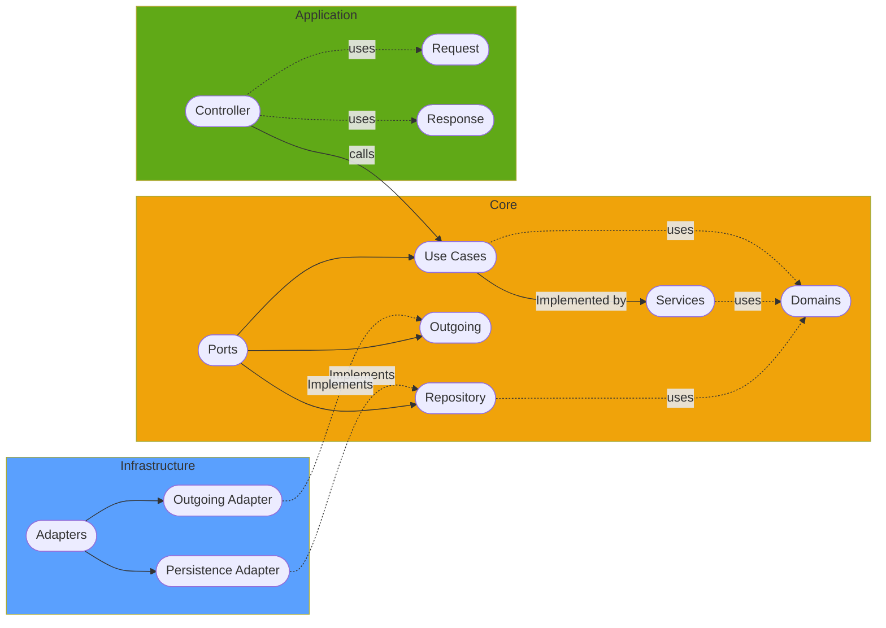

# Java & Spring Webflux DDD Microservice

This project was intended to showcase how can DDD architecture (ports and adapters) can be implemented 
with Java and gradle to create 3 different projects that contains specific part of this architecture style

## Project structure

### Application
This layer contains all entry points to the microservice (rest endpoints, cli, etc) to be able to process
request from the external world

### Core
This layer contains all core logic and its agnostic to any external framework, the idea is to have the minimum 
dependencies as possible. This layer is split it in 3 parts as follows
- Use cases: Interfaces which defines what the system can do
- Services: Use cases implementation 
- Domains: Domains of the system

### Infrastructure
This layer contains all interactions from the service with external resources such as:
- Databases
- Message brokers
- File system


## API Documentation
API documentation is based on OpenAPI 3 spec. You can find them here:
`https://localhost:8080/swagger-ui.html`

## Requirements

- Java 11
- Docker
- Gradle

## Useful commands

### Start a local database

For local development, there is a containerized mysql db setup with the appropriate ports. The spring boot application 
is also configured to use this container when running locally. To start the local DB container, execute :

```bash
./scripts/build_db_container.sh
```
### Start the service
```
./gradlew bootRun
```
Once the server starts, navigate to `https://localhost:8080/swagger-ui.html` to view API docs for your service

To debug the service locally, you can start the service with the following command and then attach a remote debugger from your IDE

```
./gradlew bootRun --debug-jvm
```

### Build/Compile

The gradle build command will run all tests, which need a running database. So please ensure you have a
local db running first.

```
./gradlew build
```

```
# Compiles all Java src and test files
./gradlew compileTestJava
```

### Code Formatting
To be able to format the code properly with Google Java code formatter standards you can run the following command
```
./gradlew googleJavaFormat
```

### Checkstyle & Linting

[Checkstyle gradle plugin](https://docs.gradle.org/current/userguide/checkstyle_plugin.html) are used enforce code formatting standards in this repository. Here are a few linter commands that are useful to run locally :

```
# Check code against linting rules. This command is run in the CI/CD pipeline as well.
./gradlew check
```

This plugin help to maintain the code clean and well structure following the  
[Java Code Conventions](https://www.oracle.com/java/technologies/javase/codeconventions-contents.html) dictated by 
Oracle. This plugin checks the code style when build the project, but you can also check manually

### OpenAPI 3 docs generating
OpenAPI is becoming the standard facto to generate API documentations and be able to exported to third-party 
platforms to expose those services to our users. 

This service includes a gradle plugin which helps to create based
on the annotations placed in the code the OpenAPI 3 specification yaml files
```
# Generates OpenAPI 3 files
./gradlew generateOpenApiDocs
```
The output file is located on [/application/build/docs/open-api](/application/build/docs/open-api)  folder

### Guides
The following guides illustrate how to use some features concretely:

* [Guide to Spring 5 Webflux](https://www.baeldung.com/spring-webflux)
* [Building reactive REST service](https://spring.io/guides/gs/reactive-rest-service/)
* [Spring MVC Async vs Webflux](https://www.baeldung.com/spring-mvc-async-vs-webflux)
* [Serving Web Content with Spring MVC](https://spring.io/guides/gs/serving-web-content/)
* [Handling errors with Spring Webflux](https://www.baeldung.com/spring-webflux-errors)
* [Building REST services with Spring](https://spring.io/guides/tutorials/bookmarks/)
* [Building a RESTful Web Service with Spring Boot Actuator](https://spring.io/guides/gs/actuator-service/)
* [Accessing Data with R2DBC](https://spring.io/guides/gs/accessing-data-r2dbc/)
* [Managing Transactions](https://spring.io/guides/gs/managing-transactions/)
* [Spring reactive guide](https://www.baeldung.com/spring-reactive-guide)
* [More about Spring Webflux](https://www.baeldung.com/?s=webflux)

### Additional Links
These additional references should also help you:

* [Gradle Build Scans – insights for your project's build](https://scans.gradle.com#gradle)
